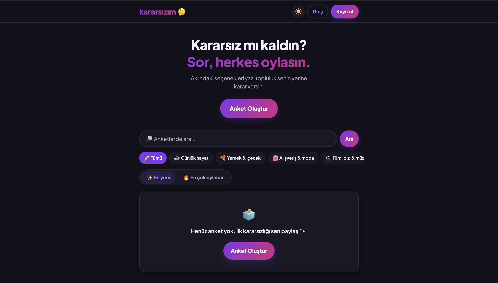
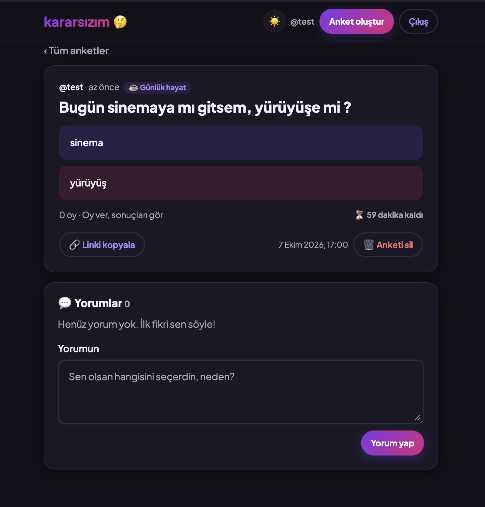
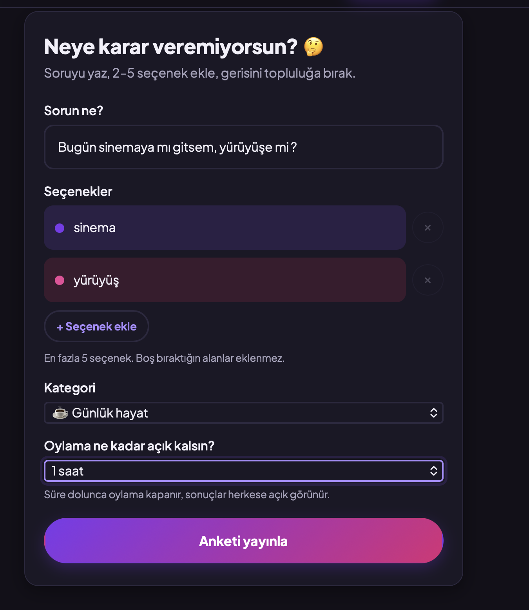
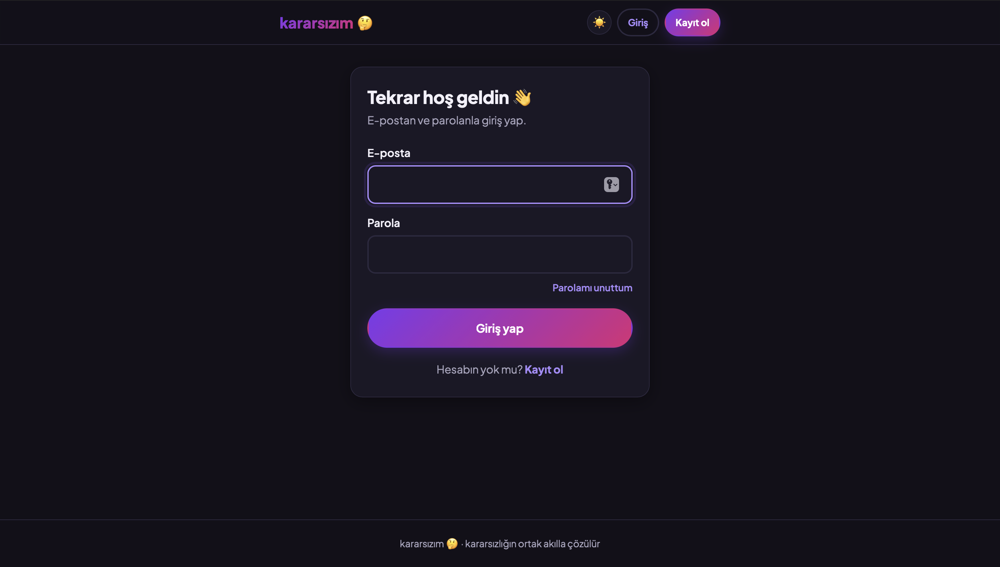

[English](README.md) | **Türkçe**

# Kararsızım 🤔

Kararsız kaldığın konularda anket aç, herkes oylasın. Django 5.2 ve saf HTML/CSS/JS ile yazıldı.
Veritabanı Supabase (Postgres), yayın Vercel.

**Canlı site:** https://kararsizim-liard.vercel.app

Proje planı ve fazlar: [`docs/KARARSIZIM_PLAN.md`](docs/KARARSIZIM_PLAN.md)

## Ekran görüntüleri

| Ana sayfa (karanlık mod) | Anket detayı |
|---|---|
|  |  |

| Anket oluştur | Giriş yap |
|---|---|
|  |  |

## Özellikler

- **2–5 seçenekli anketler.** Her seçeneğe isteğe bağlı bir görsel eklenebilir; görsel WebP'ye çevrilip Supabase Storage'a yüklenir.
- **Üye olmadan oy verme.** Ziyaretçiye çerez tabanlı bir oy anahtarı verilir. Üyelerin hesap başına tek oyu vardır ve oylarını değiştirebilirler.
- **Sayfa yenilenmeden oy verme.** JavaScript kapalıyken de çalışır.
- **Süreli anketler.** Anket kalan süreyi gösterir, süre dolunca kendiliğinden kapanır ve sonuçlar görünür.
- **Kategori, arama ve sıralama** (en yeni / en çok oylanan). Arama Türkçe İ/ı harflerini doğru eşleştirir.
- **Yorumlar** (yalnızca üyeler) ve **kullanıcı profilleri**.
- **Şikayet ve moderasyon.** 5 farklı üye şikayet edince anket otomatik gizlenir. Admin gizleyip geri açabilir.
- **Hesap işlemleri:** kayıt, e-posta ile giriş, parola değiştirme, e-posta ile parola sıfırlama (Resend).
- **Karanlık mod.** Sistem ayarını izler, elle de değiştirilebilir.
- **Paylaşım önizlemesi.** Her anket için Open Graph görseli üretilir (`/anket/<id>/paylasim.png`).
- **Hız sınırı.** Oy, anket, yorum, şikayet, giriş ve kayıt işlemlerinde geçerlidir.

## Teknolojiler

| Katman | Seçim |
|---|---|
| Backend | Django 5.2 (fonksiyon tabanlı view'lar), Python 3.12 |
| Frontend | Django şablonları, saf CSS ve JS (build adımı yok) |
| Veritabanı | Supabase Postgres (Transaction pooler); yerelde SQLite |
| Depolama | Supabase Storage (`option-images` bucket) |
| E-posta | Resend (yoksa SMTP, o da yoksa konsol) |
| Görseller | Pillow |
| Statik dosyalar | WhiteNoise / Vercel CDN |
| Yayın | Vercel (bölge `fra1`) |

## Proje yapısı

```
config/        ayarlar, urls, wsgi
accounts/      özel User modeli, e-posta ile giriş, hesap view'ları, Resend e-posta backend'i
polls/         modeller (Poll, Option, Vote, Report, Comment, RateLimitHit), view'lar, formlar,
               services.py, ratelimit.py, storage.py, share_image.py, templatetags/
templates/     HTML şablonları
static/        css/main.css, js/main.js, js/poll_form.js, js/vote.js
docs/          proje planı ve ekran görüntüleri
```

## Yerel kurulum

Python 3.12 önerilir (3.10+ çalışır).

```bash
python3 -m venv .venv
source .venv/bin/activate
pip install -r requirements.txt
cp .env.example .env          # DJANGO_SECRET_KEY'i değiştir, DATABASE_URL'i boş bırak (SQLite)
python manage.py migrate
python manage.py createsuperuser
python manage.py runserver
```

- Site: http://127.0.0.1:8000/
- Admin: http://127.0.0.1:8000/admin/

Gizli anahtar üretmek için:

```bash
python -c "import secrets; print(secrets.token_urlsafe(50))"
```

### Kontroller ve testler

```bash
python manage.py check
python manage.py makemigrations --check --dry-run
python manage.py test
```

## Ortam değişkenleri

| Değişken | Yerel | Vercel (Production) | Gizli mi? |
|---|---|---|---|
| `DJANGO_SECRET_KEY` | herhangi bir değer | uzun rastgele değer | **Evet** |
| `DJANGO_DEBUG` | `True` | `False` | Hayır |
| `DJANGO_ALLOWED_HOSTS` | `localhost,127.0.0.1` | `kararsizim-liard.vercel.app`. Joker kullanılmaz; deploy'a özel adresler `VERCEL_URL` ile otomatik eklenir. | Hayır |
| `DJANGO_CSRF_TRUSTED_ORIGINS` | — | `https://kararsizim-liard.vercel.app` | Hayır |
| `DATABASE_URL` | boş (SQLite) | Supabase Transaction pooler dizesi | **Evet** |
| `SUPABASE_URL` | isteğe bağlı | `https://<proje-ref>.supabase.co` | Hayır |
| `SUPABASE_SERVICE_ROLE_KEY` | isteğe bağlı | Supabase → Project Settings → API Keys → secret / service_role | **Evet** |
| `RESEND_API_KEY` | isteğe bağlı (yoksa e-postalar konsola yazılır) | Resend → API Keys | **Evet** |
| `DEFAULT_FROM_EMAIL` | — | `Kararsızım <onboarding@resend.dev>` (alan adı doğrulanınca kendi adresin) | Hayır |
| `EMAIL_HOST`, `EMAIL_PORT`, `EMAIL_HOST_USER`, `EMAIL_HOST_PASSWORD` | — | yalnızca Resend yerine SMTP kullanılacaksa | Parola **evet** |

## Supabase (veritabanı)

1. **Bağlantı dizesi:** Dashboard → proje → **Connect** → **Transaction pooler** (port **6543**).
   Parolada `@ : / ? # %` gibi karakterler varsa URL-kodla (ör. `@` → `%40`).
2. **Migration'ı geliştirici makinesinden çalıştır** (build sırasında değil):
   ```bash
   read -s DATABASE_URL && export DATABASE_URL   # pooler adresini yapıştır
   python manage.py migrate
   python manage.py createsuperuser
   unset DATABASE_URL
   ```
   Transaction pooler migration'da sorun çıkarırsa **Session pooler** dizesini (port 5432) kullan.
3. **RLS (güvenlik):** Django tablo sahibi rolle bağlandığı için RLS'den etkilenmez. Tüm `public` tablolarında RLS açık
   ve **hiç policy yok**. Böylece Supabase'in otomatik REST API'si (anon key) tablolara erişemez. Yeni bir tablo
   oluşturulunca `ensure_rls` adlı event trigger o tabloda da RLS'i otomatik açar. Elle kontrol etmek için SQL Editor'de:
   ```sql
   -- RLS'i kapalı tablo kaldı mı?
   select tablename from pg_tables where schemaname = 'public' and not rowsecurity;

   -- public'teki tüm tablolarda RLS'i aç
   do $$
   declare t record;
   begin
     for t in select tablename from pg_tables where schemaname = 'public' loop
       execute format('alter table public.%I enable row level security', t.tablename);
     end loop;
   end $$;
   ```
4. **Seçenek görselleri:** `option-images` adlı herkese açık bir bucket kullanılır (yalnızca `image/webp`, en fazla 2 MB).
   Dosyaları yalnızca sunucu, service/secret anahtarıyla yükler ve siler. Bucket'ta hiç policy olmadığından anon anahtar dosya yükleyemez ve listeleyemez.

## Vercel (yayın)

- Vercel, Django'yu `manage.py` üzerinden tanır; giriş noktası `WSGI_APPLICATION`'dır.
- `collectstatic` build sırasında çalışır ve `/static/` dosyaları Vercel CDN'inden sunulur.
- `vercel.json` fonksiyon bölgesini **fra1 (Frankfurt)** yapar; veritabanıyla aynı bölgede olsun diye. Ayrıca her gün `/`
  adresine istek atan bir cron tanımlar. Ana sayfa veritabanını sorguladığı için ücretsiz Supabase projesi hareketsizlikten duraklatılmaz.
- Python sürümü `.python-version` dosyasından (3.12), bağımlılıklar `requirements.txt` dosyasından gelir.
- `main` dalına her push production deploy'u başlatır. Yeni migration varsa Supabase'e push'tan **önce** uygula.
- Ortam değişkenleri: Vercel → proje → **Settings → Environment Variables** (yukarıdaki tablo).

## Deploy sonrası duman testi

- [ ] Ana sayfa açılıyor; CSS/JS yükleniyor (renkler, font)
- [ ] Kayıt ol → otomatik giriş; navbar'da `@kullaniciadi` görünüyor
- [ ] Çıkış → e-posta ile tekrar giriş
- [ ] Anket oluştur (2–5 seçenek)
- [ ] Gizli pencerede ziyaretçi olarak oy ver → sonuçlar görünüyor; sayfa yenilenince de kalıyor
- [ ] Üye olarak oy ver → ikinci oy engelleniyor
- [ ] `/admin/` → superuser ile giriş; anketler ve oylar görünüyor
- [ ] Supabase REST API'den anon key ile tablolar okunamıyor (RLS)
- [ ] Oy değiştirme, süreli anket (kapanınca sonuçlar), kategori filtresi, arama
- [ ] Yorum yaz / sil; anketi şikayet et; admin'de gizle / göster
- [ ] Parolamı unuttum e-postası, seçeneğe görsel ekleme, karanlık mod, paylaşım önizlemesi

## Güvenlik notları

- Gizli bilgiler yalnızca ortam değişkenlerinde tutulur; `.env` gitignore'dadır.
- Her formda CSRF koruması vardır. Production'da HTTPS yönlendirmesi ve güvenli oturum/CSRF çerezleri açıktır; host listesinde joker yoktur.
- Oy çerezi HttpOnly ve SameSite=Lax'tir. Mükerrer oyları veritabanı kısıtları engeller.
- Hız sınırı veritabanında tutulur. Vercel arkasında istemci IP'si `X-Forwarded-For` başlığından alınır.
- Yüklenen görseller depolanmadan önce Pillow ile yeniden kodlanır; boyut ve biçim kontrol edilir.
